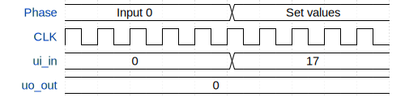

# Tadder

**Source:** [https://github.com/potatojuicemachine/tiny-tapeout](https://github.com/potatojuicemachine/tiny-tapeout)

**TinyTapeout Project Page:** [https://app.tinytapeout.com/projects/3508](https://app.tinytapeout.com/projects/3508)

## Input/Output Definitions

| Signal | Type | Width |
|--------|------|-------|
| ui_in | input | 8 |
| uo_out | output | 8 |

## Bit Patterns

### Input (ui_in)
- **ui_in**: Input signal mappings

### Output (uo_out)
- **uo_out**: Output signal mappings

## Test Waveform

