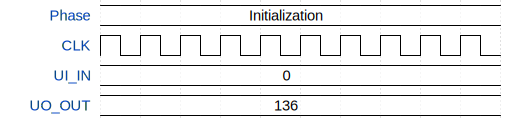

# Silly Dog VGA

**Source:** [https://github.com/danielowa/vga-tt](https://github.com/danielowa/vga-tt)

**TinyTapeout Project Page:** [https://app.tinytapeout.com/projects/3512](https://app.tinytapeout.com/projects/3512)

## Input/Output Definitions

| Signal | Type | Width |
|--------|------|-------|
| UI_IN | input | 8 |
| UO_OUT | output | 8 |

## First 10 Cycles

| Cycle | Phase | UI_IN | UO_OUT |
|-------|-------|-------|-------|
| 0 | Initialization | 0x0 | 0x88 |
| 1 | Initialization | 0x0 | 0x88 |
| 2 | Initialization | 0x0 | 0x88 |
| 3 | Initialization | 0x0 | 0x88 |
| 4 | Initialization | 0x0 | 0x88 |
| 5 | Initialization | 0x0 | 0x88 |
| 6 | Initialization | 0x0 | 0x88 |
| 7 | Initialization | 0x0 | 0x88 |
| 8 | Initialization | 0x0 | 0x88 |
| 9 | Initialization | 0x0 | 0x88 |

## Test Waveform

