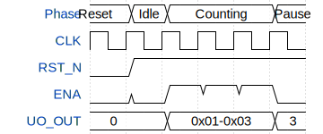

# tinyTapeVerilog_out

**Source:** [https://github.com/floAfentaki/tinyTapeVerilog_out](https://github.com/floAfentaki/tinyTapeVerilog_out)

**TinyTapeout Project Page:** [https://app.tinytapeout.com/projects/3526](https://app.tinytapeout.com/projects/3526)

## Input/Output Definitions

| Signal | Type | Width |
|--------|------|-------|
| CLK | clock | 1 |
| RST_N | input | 1 |
| ENA | input | 1 |
| UO_OUT | output | 8 |

## Test Waveform

