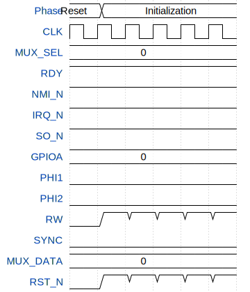

# m6502 Microcontroller

**Source:** [https://github.com/chrismoos/tt-led-controller](https://github.com/chrismoos/tt-led-controller)

**TinyTapeout Project Page:** [https://app.tinytapeout.com/projects/3528](https://app.tinytapeout.com/projects/3528)

## Input/Output Definitions

| Signal | Type | Width |
|--------|------|-------|
| MUX_SEL | input | 2 |
| RDY | input | 1 |
| NMI_N | input | 1 |
| IRQ_N | input | 1 |
| SO_N | input | 1 |
| GPIOA | inout | 6 |
| PHI1 | output | 1 |
| PHI2 | output | 1 |
| RW | output | 1 |
| SYNC | output | 1 |
| MUX_DATA | inout | 8 |
| CLK | clock | 1 |
| RST_N | input | 1 |

## Test Waveform

