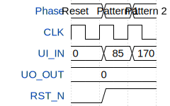

# Piggybag

**Source:** [https://github.com/Fing2525/piggy_bag](https://github.com/Fing2525/piggy_bag)

**TinyTapeout Project Page:** [https://app.tinytapeout.com/projects/3533](https://app.tinytapeout.com/projects/3533)

## Input/Output Definitions

| Signal | Type | Width |
|--------|------|-------|
| UI_IN | input | 8 |
| UO_OUT | output | 8 |
| CLK | clock | 1 |
| RST_N | input | 1 |

## First 10 Cycles

| Cycle | Phase | UI_IN | UO_OUT | RST_N |
|-------|-------|-------|-------|-------|
| 0 | Reset | 0x0 | 0x0 | 0x0 |
| 1 | Pattern 1 | 0x55 | 0x0 | 0x1 |
| 2 | Pattern 2 | 0xaa | 0x0 | 0x1 |

## Test Waveform

