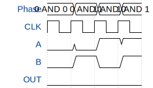

# TinyTapeOut_gate

**Source:** [https://github.com/henrikscheidt99/tinytapeout](https://github.com/henrikscheidt99/tinytapeout)

**TinyTapeout Project Page:** [https://app.tinytapeout.com/projects/3534](https://app.tinytapeout.com/projects/3534)

## Input/Output Definitions

| Signal | Type | Width |
|--------|------|-------|
| A | input | 1 |
| B | input | 1 |
| OUT | output | 1 |

## Test Waveform

