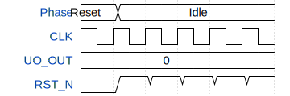

# 6 Bit Roulette

**Source:** [https://github.com/svens0210/Roulette_Game](https://github.com/svens0210/Roulette_Game)

**TinyTapeout Project Page:** [https://app.tinytapeout.com/projects/3537](https://app.tinytapeout.com/projects/3537)

## Input/Output Definitions

| Signal | Type | Width |
|--------|------|-------|
| UO_OUT | output | 8 |
| CLK | clock | 1 |
| RST_N | input | 1 |

## First 10 Cycles

| Cycle | Phase | UO_OUT | RST_N |
|-------|-------|-------|-------|
| 0 | Reset | 0x0 | 0x0 |
| 1 | Idle | 0x0 | 0x1 |
| 2 | Idle | 0x0 | 0x1 |
| 3 | Idle | 0x0 | 0x1 |
| 4 | Idle | 0x0 | 0x1 |
| 5 | Idle | 0x0 | 0x1 |

## Test Waveform

