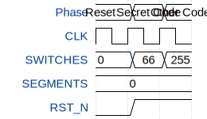

# My first Wokwi design

**Source:** [https://github.com/PolykarposV/tt_workshop](https://github.com/PolykarposV/tt_workshop)

**TinyTapeout Project Page:** [https://app.tinytapeout.com/projects/3540](https://app.tinytapeout.com/projects/3540)

## Input/Output Definitions

| Signal | Type | Width |
|--------|------|-------|
| SWITCHES | input | 8 |
| SEGMENTS | output | 8 |
| CLK | clock | 1 |
| RST_N | input | 1 |

## Test Waveform

