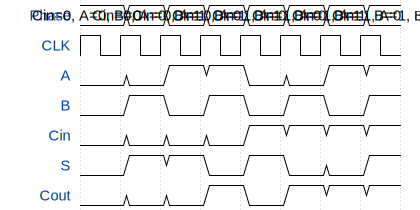

# tt3541-2bit-adder

**Source:** [https://github.com/zeynepdemirdag/tiny-tapeout-submission](https://github.com/zeynepdemirdag/tiny-tapeout-submission)

**TinyTapeout Project Page:** [https://app.tinytapeout.com/projects/3541](https://app.tinytapeout.com/projects/3541)

## Input/Output Definitions

| Signal | Type | Width |
|--------|------|-------|
| A | input | 1 |
| B | input | 1 |
| Cin | input | 1 |
| S | output | 1 |
| Cout | output | 1 |

## First 10 Cycles

| Cycle | Phase | A | B | Cin | S | Cout |
|-------|-------|-------|-------|-------|-------|-------|
| 0 | Cin=0, A=0, B=0 | 0x0 | 0x0 | 0x0 | 0x0 | 0x0 |
| 1 | Cin=0, A=0, B=1 | 0x0 | 0x1 | 0x0 | 0x1 | 0x0 |
| 2 | Cin=0, A=1, B=0 | 0x1 | 0x0 | 0x0 | 0x1 | 0x0 |
| 3 | Cin=0, A=1, B=1 | 0x1 | 0x1 | 0x0 | 0x0 | 0x1 |
| 4 | Cin=1, A=0, B=0 | 0x0 | 0x0 | 0x1 | 0x1 | 0x0 |
| 5 | Cin=1, A=0, B=1 | 0x0 | 0x1 | 0x1 | 0x0 | 0x1 |
| 6 | Cin=1, A=1, B=0 | 0x1 | 0x0 | 0x1 | 0x0 | 0x1 |
| 7 | Cin=1, A=1, B=1 | 0x1 | 0x1 | 0x1 | 0x1 | 0x1 |

## Test Waveform

