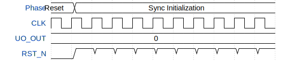

# VGABlock

**Source:** [https://github.com/ezelioli/tt-efcl-workshop](https://github.com/ezelioli/tt-efcl-workshop)

**TinyTapeout Project Page:** [https://app.tinytapeout.com/projects/3542](https://app.tinytapeout.com/projects/3542)

## Input/Output Definitions

| Signal | Type | Width |
|--------|------|-------|
| UO_OUT | output | 8 |
| CLK | clock | 1 |
| RST_N | input | 1 |

## Test Waveform

