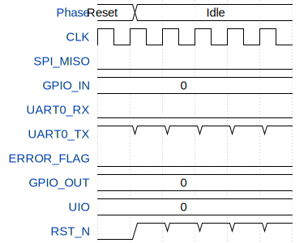

# SotaSoC

**Source:** [https://github.com/sotatek-dev/ttihp-SotaSoC](https://github.com/sotatek-dev/ttihp-SotaSoC)

**TinyTapeout Project Page:** [https://app.tinytapeout.com/projects/3543](https://app.tinytapeout.com/projects/3543)

## Input/Output Definitions

| Signal | Type | Width |
|--------|------|-------|
| SPI_MISO | input | 1 |
| GPIO_IN | input | 6 |
| UART0_RX | input | 1 |
| UART0_TX | output | 1 |
| ERROR_FLAG | output | 1 |
| GPIO_OUT | output | 6 |
| UIO | inout | 8 |
| CLK | clock | 1 |
| RST_N | input | 1 |

## First 10 Cycles

| Cycle | Phase | SPI_MISO | GPIO_IN | UART0_RX | UART0_TX | ERROR_FLAG | GPIO_OUT | UIO | RST_N |
|-------|-------|-------|-------|-------|-------|-------|-------|-------|-------|
| 0 | Reset | 0x0 | 0x0 | 0x0 | 0x1 | 0x0 | 0x0 | 0x0 | 0x0 |
| 1 | Idle | 0x0 | 0x0 | 0x0 | 0x1 | 0x0 | 0x0 | 0x0 | 0x1 |
| 2 | Idle | 0x0 | 0x0 | 0x0 | 0x1 | 0x0 | 0x0 | 0x0 | 0x1 |
| 3 | Idle | 0x0 | 0x0 | 0x0 | 0x1 | 0x0 | 0x0 | 0x0 | 0x1 |
| 4 | Idle | 0x0 | 0x0 | 0x0 | 0x1 | 0x0 | 0x0 | 0x0 | 0x1 |
| 5 | Idle | 0x0 | 0x0 | 0x0 | 0x1 | 0x0 | 0x0 | 0x0 | 0x1 |

## Test Waveform

