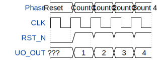

# tt3546-counter

**Source:** [https://github.com/mlhktp/ttihp-wokwi](https://github.com/mlhktp/ttihp-wokwi)

**TinyTapeout Project Page:** [https://app.tinytapeout.com/projects/3546](https://app.tinytapeout.com/projects/3546)

## Input/Output Definitions

| Signal | Type | Width |
|--------|------|-------|
| RST_N | input | 1 |
| UO_OUT | output | 8 |

## Test Waveform

