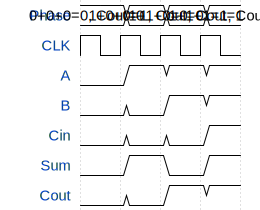

# Full Adder Test

**Source:** [https://github.com/joh-1x/tiny-tapeout-workshop](https://github.com/joh-1x/tiny-tapeout-workshop)

**TinyTapeout Project Page:** [https://app.tinytapeout.com/projects/3548](https://app.tinytapeout.com/projects/3548)

## Input/Output Definitions

| Signal | Type | Width |
|--------|------|-------|
| A | input | 1 |
| B | input | 1 |
| Cin | input | 1 |
| Sum | output | 1 |
| Cout | output | 1 |

## Test Waveform

