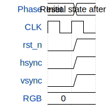

# Tiny Triangle Rasterizer

**Source:** [https://github.com/tomolt/tomolt_tiny_tapeout_ic](https://github.com/tomolt/tomolt_tiny_tapeout_ic)

**TinyTapeout Project Page:** [https://app.tinytapeout.com/projects/3549](https://app.tinytapeout.com/projects/3549)

## Input/Output Definitions

| Signal | Type | Width |
|--------|------|-------|
| rst_n | input | 1 |
| hsync | output | 1 |
| vsync | output | 1 |
| RGB | output | 3 |

## Test Waveform

