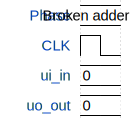

# adder

**Source:** [https://github.com/stsar/tiny_tapeout](https://github.com/stsar/tiny_tapeout)

**TinyTapeout Project Page:** [https://app.tinytapeout.com/projects/3553](https://app.tinytapeout.com/projects/3553)

## Input/Output Definitions

| Signal | Type | Width |
|--------|------|-------|
| ui_in | input | 8 |
| uo_out | output | 8 |
| clk | clock | 1 |
| rst_n | input | 1 |

## First 10 Cycles

| Cycle | Phase | ui_in | uo_out | rst_n |
|-------|-------|-------|-------|-------|
| 0 | Reset | 0x0 (a=0, b=0, c=0) | 0x0 (a=0, b=0, c=0, d=0) | 0x0 |
| 1 | A=0, B=0, Cin=0 | 0x0 (a=0, b=0, c=0) | 0x3 (a=1, b=1, c=0, d=0) | 0x1 |
| 2 | A=0, B=0, Cin=1 | 0x80 (a=0, b=0, c=1) | 0x83 (a=1, b=1, c=0, d=1) | 0x1 |
| 3 | A=0, B=1, Cin=0 | 0x40 (a=0, b=1, c=0) | 0x83 (a=1, b=1, c=0, d=1) | 0x1 |
| 4 | A=0, B=1, Cin=1 | 0xc0 (a=0, b=1, c=1) | 0x43 (a=1, b=1, c=1, d=0) | 0x1 |
| 5 | A=1, B=0, Cin=0 | 0x20 (a=1, b=0, c=0) | 0x83 (a=1, b=1, c=0, d=1) | 0x1 |
| 6 | A=1, B=0, Cin=1 | 0xa0 (a=1, b=0, c=1) | 0x43 (a=1, b=1, c=1, d=0) | 0x1 |
| 7 | A=1, B=1, Cin=0 | 0x60 (a=1, b=1, c=0) | 0x43 (a=1, b=1, c=1, d=0) | 0x1 |
| 8 | A=1, B=1, Cin=1 | 0xe0 (a=1, b=1, c=1) | 0xc3 (a=1, b=1, c=1, d=1) | 0x1 |
| 9 | Counter Pulse | 0x0 (a=0, b=0, c=0) | 0x3 (a=1, b=1, c=0, d=0) | 0x1 |

## Bit Patterns

### Input (ui_in)
- **ui_in**: Input signal mappings

### Output (uo_out)
- **uo_out**: Output signal mappings

## Test Waveform

