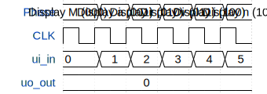

# 7-Segment-Wokwi-Design

**Source:** [https://github.com/MarvinBrth/7-Segment-Wokwi-Design](https://github.com/MarvinBrth/7-Segment-Wokwi-Design)

**TinyTapeout Project Page:** [https://app.tinytapeout.com/projects/3554](https://app.tinytapeout.com/projects/3554)

## Input/Output Definitions

| Signal | Type | Width |
|--------|------|-------|
| ui_in | input | 3 |
| uo_out | output | 7 |

## First 10 Cycles

| Cycle | Phase | ui_in | uo_out |
|-------|-------|-------|-------|
| 0 | Display M (000) | 0x0 (1.Bit for Letter selection=0, 2.Bit for Letter selection=0, 3.Bit for Letter selection=0) | 0x0 (a-pin on the 7-Segment=0, b-pin on the 7-Segment=0, c-pin on the 7-Segment=0, d-pin on the 7-Segment=0, e-pin on the 7-Segment=0, f-pin on the 7-Segment=0, g-pin on the 7-Segment=0) |
| 1 | Display a (001) | 0x1 (1.Bit for Letter selection=1, 2.Bit for Letter selection=0, 3.Bit for Letter selection=0) | 0x0 (a-pin on the 7-Segment=0, b-pin on the 7-Segment=0, c-pin on the 7-Segment=0, d-pin on the 7-Segment=0, e-pin on the 7-Segment=0, f-pin on the 7-Segment=0, g-pin on the 7-Segment=0) |
| 2 | Display r (010) | 0x2 (1.Bit for Letter selection=0, 2.Bit for Letter selection=1, 3.Bit for Letter selection=0) | 0x0 (a-pin on the 7-Segment=0, b-pin on the 7-Segment=0, c-pin on the 7-Segment=0, d-pin on the 7-Segment=0, e-pin on the 7-Segment=0, f-pin on the 7-Segment=0, g-pin on the 7-Segment=0) |
| 3 | Display v (011) | 0x3 (1.Bit for Letter selection=1, 2.Bit for Letter selection=1, 3.Bit for Letter selection=0) | 0x0 (a-pin on the 7-Segment=0, b-pin on the 7-Segment=0, c-pin on the 7-Segment=0, d-pin on the 7-Segment=0, e-pin on the 7-Segment=0, f-pin on the 7-Segment=0, g-pin on the 7-Segment=0) |
| 4 | Display i (100) | 0x4 (1.Bit for Letter selection=0, 2.Bit for Letter selection=0, 3.Bit for Letter selection=1) | 0x0 (a-pin on the 7-Segment=0, b-pin on the 7-Segment=0, c-pin on the 7-Segment=0, d-pin on the 7-Segment=0, e-pin on the 7-Segment=0, f-pin on the 7-Segment=0, g-pin on the 7-Segment=0) |
| 5 | Display n (101) | 0x5 (1.Bit for Letter selection=1, 2.Bit for Letter selection=0, 3.Bit for Letter selection=1) | 0x0 (a-pin on the 7-Segment=0, b-pin on the 7-Segment=0, c-pin on the 7-Segment=0, d-pin on the 7-Segment=0, e-pin on the 7-Segment=0, f-pin on the 7-Segment=0, g-pin on the 7-Segment=0) |

## Bit Patterns

### Input (ui_in)
- **ui_in**: Input signal mappings

### Output (uo_out)
- **uo_out**: Output signal mappings

## Test Waveform

