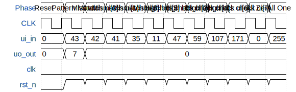

# Just logic

**Source:** [https://github.com/Jannis-Uni/TinyTapeout](https://github.com/Jannis-Uni/TinyTapeout)

**TinyTapeout Project Page:** [https://app.tinytapeout.com/projects/3559](https://app.tinytapeout.com/projects/3559)

## Input/Output Definitions

| Signal | Type | Width |
|--------|------|-------|
| ui_in | input | 8 |
| uo_out | output | 8 |
| clk | clock | 1 |
| rst_n | input | 1 |

## First 10 Cycles

| Cycle | Phase | ui_in | uo_out | rst_n |
|-------|-------|-------|-------|-------|
| 0 | Reset | 0x0 (Active=0, Active=0, Active=0) | 0x0 (Data=0) | 0x0 |
| 1 | Pattern Match | 0x2b (Active=3, Active=1, Active=1) | 0x7 (Data=7) | 0x1 |
| 2 | Mismatch ui[0] | 0x2a (Active=2, Active=1, Active=1) | 0x0 (Data=0) | 0x1 |
| 3 | Mismatch ui[1] | 0x29 (Active=1, Active=1, Active=1) | 0x0 (Data=0) | 0x1 |
| 4 | Mismatch ui[3] | 0x23 (Active=3, Active=0, Active=1) | 0x0 (Data=0) | 0x1 |
| 5 | Mismatch ui[5] | 0xb (Active=3, Active=1, Active=0) | 0x0 (Data=0) | 0x1 |
| 6 | High bits check ui[2] | 0x2f (Active=3, Active=1, Active=1) | 0x0 (Data=0) | 0x1 |
| 7 | High bits check ui[4] | 0x3b (Active=3, Active=1, Active=1) | 0x0 (Data=0) | 0x1 |
| 8 | High bits check ui[6] | 0x6b (Active=3, Active=1, Active=1) | 0x0 (Data=0) | 0x1 |
| 9 | High bits check ui[7] | 0xab (Active=3, Active=1, Active=1) | 0x0 (Data=0) | 0x1 |

## Bit Patterns

### Input (ui_in)
- **ui_in**: Input signal mappings

### Output (uo_out)
- **uo_out**: Output signal mappings

## Test Waveform

