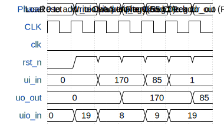

# uCore

**Source:** [https://github.com/yJulian/tiny-tapeout](https://github.com/yJulian/tiny-tapeout)

**TinyTapeout Project Page:** [https://app.tinytapeout.com/projects/3561](https://app.tinytapeout.com/projects/3561)

## Input/Output Definitions

| Signal | Type | Width |
|--------|------|-------|
| clk | clock | 1 |
| rst_n | input | 1 |
| ui_in | input | 8 |
| uo_out | output | 8 |
| uio_in | input | 8 |

## First 10 Cycles

| Cycle | Phase | rst_n | ui_in | uo_out | uio_in |
|-------|-------|-------|-------|-------|-------|
| 0 | Reset | 0x0 | 0x0 (DATA IN[0]=0, DATA IN[1]=0, DATA IN[2]=0, DATA IN[3]=0, DATA IN[4]=0, DATA IN[5]=0, DATA IN[6]=0, DATA IN[7]=0) | 0x0 (DATA OUT[0]=0, DATA OUT[1]=0, DATA OUT[2]=0, DATA OUT[3]=0, DATA OUT[4]=0, DATA OUT[5]=0, DATA OUT[6]=0, DATA OUT[7]=0) | 0x0 (IMM [0]=0, IMM [1]=0, IMM [2]=0, OP [0]=0, OP [1]=0, OP [2]=0) |
| 1 | Load 0 to addr_oio via periphery | 0x1 | 0x0 (DATA IN[0]=0, DATA IN[1]=0, DATA IN[2]=0, DATA IN[3]=0, DATA IN[4]=0, DATA IN[5]=0, DATA IN[6]=0, DATA IN[7]=0) | 0x0 (DATA OUT[0]=0, DATA OUT[1]=0, DATA OUT[2]=0, DATA OUT[3]=0, DATA OUT[4]=0, DATA OUT[5]=0, DATA OUT[6]=0, DATA OUT[7]=0) | 0x13 (IMM [0]=1, IMM [1]=1, IMM [2]=0, OP [0]=0, OP [1]=1, OP [2]=0) |
| 2 | Write 0xAA to Reg 0 | 0x1 | 0xaa (DATA IN[0]=0, DATA IN[1]=1, DATA IN[2]=0, DATA IN[3]=1, DATA IN[4]=0, DATA IN[5]=1, DATA IN[6]=0, DATA IN[7]=1) | 0x0 (DATA OUT[0]=0, DATA OUT[1]=0, DATA OUT[2]=0, DATA OUT[3]=0, DATA OUT[4]=0, DATA OUT[5]=0, DATA OUT[6]=0, DATA OUT[7]=0) | 0x8 (IMM [0]=0, IMM [1]=0, IMM [2]=0, OP [0]=1, OP [1]=0, OP [2]=0) |
| 3 | Check uo_out (Reg 0) | 0x1 | 0xaa (DATA IN[0]=0, DATA IN[1]=1, DATA IN[2]=0, DATA IN[3]=1, DATA IN[4]=0, DATA IN[5]=1, DATA IN[6]=0, DATA IN[7]=1) | 0xaa (DATA OUT[0]=0, DATA OUT[1]=1, DATA OUT[2]=0, DATA OUT[3]=1, DATA OUT[4]=0, DATA OUT[5]=1, DATA OUT[6]=0, DATA OUT[7]=1) | 0x8 (IMM [0]=0, IMM [1]=0, IMM [2]=0, OP [0]=1, OP [1]=0, OP [2]=0) |
| 4 | Write 0x55 to Reg 1 | 0x1 | 0x55 (DATA IN[0]=1, DATA IN[1]=0, DATA IN[2]=1, DATA IN[3]=0, DATA IN[4]=1, DATA IN[5]=0, DATA IN[6]=1, DATA IN[7]=0) | 0xaa (DATA OUT[0]=0, DATA OUT[1]=1, DATA OUT[2]=0, DATA OUT[3]=1, DATA OUT[4]=0, DATA OUT[5]=1, DATA OUT[6]=0, DATA OUT[7]=1) | 0x9 (IMM [0]=1, IMM [1]=0, IMM [2]=0, OP [0]=1, OP [1]=0, OP [2]=0) |
| 5 | Load 1 to addr_oio | 0x1 | 0x1 (DATA IN[0]=1, DATA IN[1]=0, DATA IN[2]=0, DATA IN[3]=0, DATA IN[4]=0, DATA IN[5]=0, DATA IN[6]=0, DATA IN[7]=0) | 0xaa (DATA OUT[0]=0, DATA OUT[1]=1, DATA OUT[2]=0, DATA OUT[3]=1, DATA OUT[4]=0, DATA OUT[5]=1, DATA OUT[6]=0, DATA OUT[7]=1) | 0x13 (IMM [0]=1, IMM [1]=1, IMM [2]=0, OP [0]=0, OP [1]=1, OP [2]=0) |
| 6 | Check uo_out (Reg 1) | 0x1 | 0x1 (DATA IN[0]=1, DATA IN[1]=0, DATA IN[2]=0, DATA IN[3]=0, DATA IN[4]=0, DATA IN[5]=0, DATA IN[6]=0, DATA IN[7]=0) | 0x55 (DATA OUT[0]=1, DATA OUT[1]=0, DATA OUT[2]=1, DATA OUT[3]=0, DATA OUT[4]=1, DATA OUT[5]=0, DATA OUT[6]=1, DATA OUT[7]=0) | 0x13 (IMM [0]=1, IMM [1]=1, IMM [2]=0, OP [0]=0, OP [1]=1, OP [2]=0) |

## Bit Patterns

### Input (ui_in)
- **ui_in**: Input signal mappings

### Output (uo_out)
- **uo_out**: Output signal mappings

### Bidirectional (uio_in)
- **uio_in**: Bidirectional signal mappings

## Test Waveform

