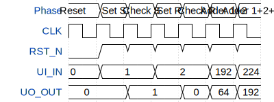

# RS Half adder

**Source:** [https://github.com/yNiklas/tt-chip-design](https://github.com/yNiklas/tt-chip-design)

**TinyTapeout Project Page:** [https://app.tinytapeout.com/projects/3563](https://app.tinytapeout.com/projects/3563)

## Input/Output Definitions

| Signal | Type | Width |
|--------|------|-------|
| CLK | clock | 1 |
| RST_N | input | 1 |
| UI_IN | input | 8 |
| UO_OUT | output | 8 |

## First 10 Cycles

| Cycle | Phase | RST_N | UI_IN | UO_OUT |
|-------|-------|-------|-------|-------|
| 0 | Reset | 0x0 | 0x0 | 0x0 |
| 1 | Set S | 0x1 | 0x1 | 0x0 |
| 2 | Check S | 0x1 | 0x1 | 0x1 |
| 3 | Set R | 0x1 | 0x2 | 0x1 |
| 4 | Check R | 0x1 | 0x2 | 0x0 |
| 5 | Adder 1+2 | 0x1 | 0xc0 | 0x40 |
| 6 | Adder 1+2+3 | 0x1 | 0xe0 | 0xc0 |

## Test Waveform

