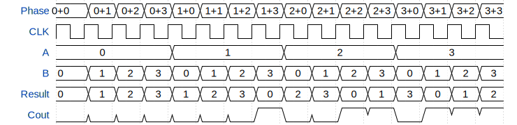

# tt3564-2bit-adder

**TinyTapeout Project Page:** [https://app.tinytapeout.com/projects/3564](https://app.tinytapeout.com/projects/3564)

## Input/Output Definitions

| Signal | Type | Width |
|--------|------|-------|
| A | input | 2 |
| B | input | 2 |
| Result | output | 2 |
| Cout | output | 1 |

## Test Waveform

