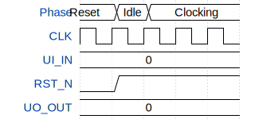

# FH Joanneum TinyTapeout

**Source:** [https://github.com/leo0111001/TTIHP26a-FH-Joanneum](https://github.com/leo0111001/TTIHP26a-FH-Joanneum)

**TinyTapeout Project Page:** [https://app.tinytapeout.com/projects/3565](https://app.tinytapeout.com/projects/3565)

## Input/Output Definitions

| Signal | Type | Width |
|--------|------|-------|
| UI_IN | input | 8 |
| CLK | input | 1 |
| RST_N | input | 1 |
| UO_OUT | output | 8 |

## Test Waveform

