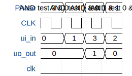

# test (AND gate)

**Source:** [https://github.com/DasKunstUngetuem/tt](https://github.com/DasKunstUngetuem/tt)

**TinyTapeout Project Page:** [https://app.tinytapeout.com/projects/3566](https://app.tinytapeout.com/projects/3566)

## Input/Output Definitions

| Signal | Type | Width |
|--------|------|-------|
| ui_in | input | 8 |
| uo_out | output | 8 |
| clk | clock | 1 |

## Test Waveform

