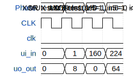

# Tiny Tapeout N

**Source:** [https://github.com/Nama222/Tiny-Tapeout](https://github.com/Nama222/Tiny-Tapeout)

**TinyTapeout Project Page:** [https://app.tinytapeout.com/projects/3571](https://app.tinytapeout.com/projects/3571)

## Input/Output Definitions

| Signal | Type | Width |
|--------|------|-------|
| clk | clock | 1 |
| ui_in | input | 8 |
| uo_out | output | 8 |

## Test Waveform

