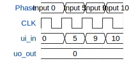

# Tudor BCD Test

**Source:** [https://github.com/Tuda05/TinyTapeout](https://github.com/Tuda05/TinyTapeout)

**TinyTapeout Project Page:** [https://app.tinytapeout.com/projects/3574](https://app.tinytapeout.com/projects/3574)

## Input/Output Definitions

| Signal | Type | Width |
|--------|------|-------|
| ui_in | input | 8 |
| uo_out | output | 8 |

## Test Waveform

