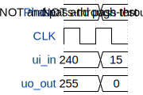

# Tiny Tapeout Test

**Source:** [https://github.com/MertErmann/tiny_tapeout_1](https://github.com/MertErmann/tiny_tapeout_1)

**TinyTapeout Project Page:** [https://app.tinytapeout.com/projects/3576](https://app.tinytapeout.com/projects/3576)

## Input/Output Definitions

| Signal | Type | Width |
|--------|------|-------|
| ui_in | input | 8 |
| uo_out | output | 8 |

## First 10 Cycles

| Cycle | Phase | ui_in | uo_out |
|-------|-------|-------|-------|
| 0 | NOT and pass-through test | 0xf0 (Sample in bit 0 (LSB)=0, Sample in bit 1=0, Sample in bit 2=0, Sample in bit 3=0, Sample in bit 4=1, Sample in bit 5=1, Sample in bit 6=1, Sample in bit 7 (MSB, sign)=1) | 0xff (Filtered output bit 0 (LSB)=1, Filtered output bit 1=1, Filtered output bit 2=1, Filtered output bit 3=1, Filtered output bit 4=1, Filtered output bit 5=1, Filtered output bit 6=1, Filtered output bit 7 (MSB, sign)=1) |
| 1 | NOT and pass-through test 2 | 0xf (Sample in bit 0 (LSB)=1, Sample in bit 1=1, Sample in bit 2=1, Sample in bit 3=1, Sample in bit 4=0, Sample in bit 5=0, Sample in bit 6=0, Sample in bit 7 (MSB, sign)=0) | 0x0 (Filtered output bit 0 (LSB)=0, Filtered output bit 1=0, Filtered output bit 2=0, Filtered output bit 3=0, Filtered output bit 4=0, Filtered output bit 5=0, Filtered output bit 6=0, Filtered output bit 7 (MSB, sign)=0) |

## Bit Patterns

### Input (ui_in)
- **ui_in**: Input signal mappings

### Output (uo_out)
- **uo_out**: Output signal mappings

## Test Waveform

