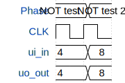

# random stuff (NOT gates)

**Source:** [https://github.com/vlad-penchev/tinytapeoutz](https://github.com/vlad-penchev/tinytapeoutz)

**TinyTapeout Project Page:** [https://app.tinytapeout.com/projects/3581](https://app.tinytapeout.com/projects/3581)

## Input/Output Definitions

| Signal | Type | Width |
|--------|------|-------|
| ui_in | input | 8 |
| uo_out | output | 8 |

## First 10 Cycles

| Cycle | Phase | ui_in | uo_out |
|-------|-------|-------|-------|
| 0 | NOT test | 0x4 (HI=0, LO=0) | 0x4 (seg_a=0, seg_b=0, seg_c=1, seg_d=0, seg_e=0, seg_f=0, seg_g=0, seg_h=0) |
| 1 | NOT test 2 | 0x8 (HI=0, LO=0) | 0x8 (seg_a=0, seg_b=0, seg_c=0, seg_d=1, seg_e=0, seg_f=0, seg_g=0, seg_h=0) |

## Bit Patterns

### Input (ui_in)
- **ui_in**: Input signal mappings

### Output (uo_out)
- **uo_out**: Output signal mappings

## Test Waveform

