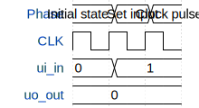

# 83rk: Tiny Tapeout

**Source:** [https://github.com/83rk/83rkFlipFlop](https://github.com/83rk/83rkFlipFlop)

**TinyTapeout Project Page:** [https://app.tinytapeout.com/projects/3589](https://app.tinytapeout.com/projects/3589)

## Input/Output Definitions

| Signal | Type | Width |
|--------|------|-------|
| ui_in | input | 8 |
| uo_out | output | 8 |

## Test Waveform

