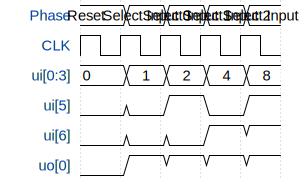

# 4-to-1 Multiplexer

**Source:** [https://github.com/kenny3010/GDS1](https://github.com/kenny3010/GDS1)

**TinyTapeout Project Page:** [https://app.tinytapeout.com/projects/3592](https://app.tinytapeout.com/projects/3592)

## Input/Output Definitions

| Signal | Type | Width |
|--------|------|-------|
| ui[0:3] | input | 4 |
| ui[5] | input | 1 |
| ui[6] | input | 1 |
| uo[0] | output | 1 |

## First 10 Cycles

| Cycle | Phase | ui[0:3] | ui[5] | ui[6] | uo[0] |
|-------|-------|-------|-------|-------|-------|
| 0 | Reset | 0x0 | 0x0 | 0x0 | 0x0 |
| 1 | Select Input 0 | 0x1 | 0x0 | 0x0 | 0x1 |
| 2 | Select Input 1 | 0x2 | 0x1 | 0x0 | 0x1 |
| 3 | Select Input 2 | 0x4 | 0x0 | 0x1 | 0x1 |
| 4 | Select Input 3 | 0x8 | 0x1 | 0x1 | 0x1 |

## Test Waveform

