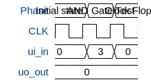

# Test

**Source:** [https://github.com/darius1702/tt-asic](https://github.com/darius1702/tt-asic)

**TinyTapeout Project Page:** [https://app.tinytapeout.com/projects/3594](https://app.tinytapeout.com/projects/3594)

## Input/Output Definitions

| Signal | Type | Width |
|--------|------|-------|
| ui_in | input | 8 |
| uo_out | output | 8 |

## First 10 Cycles

| Cycle | Phase | ui_in | uo_out |
|-------|-------|-------|-------|
| 0 | Initial state | 0x0 (input a=0, input b=0, input c=0, input d=0, input e=0, input f=0, input g=0, input h=0) | 0x0 (output a=0, output b=0, output c=0, output d=0, output e=0, output f=0, output g=0, output h=0) |
| 1 | AND Gate Test | 0x3 (input a=1, input b=1, input c=0, input d=0, input e=0, input f=0, input g=0, input h=0) | 0x0 (output a=0, output b=0, output c=0, output d=0, output e=0, output f=0, output g=0, output h=0) |
| 2 | Clock Flop | 0x0 (input a=0, input b=0, input c=0, input d=0, input e=0, input f=0, input g=0, input h=0) | 0x0 (output a=0, output b=0, output c=0, output d=0, output e=0, output f=0, output g=0, output h=0) |

## Bit Patterns

### Input (ui_in)
- **ui_in**: Input signal mappings

### Output (uo_out)
- **uo_out**: Output signal mappings

## Test Waveform

