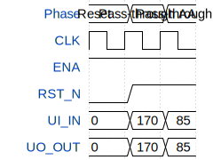

# Hello tinyTapout

**Source:** [https://github.com/SinnMachen/nein](https://github.com/SinnMachen/nein)

**TinyTapeout Project Page:** [https://app.tinytapeout.com/projects/3595](https://app.tinytapeout.com/projects/3595)

## Input/Output Definitions

| Signal | Type | Width |
|--------|------|-------|
| ENA | input | 1 |
| RST_N | input | 1 |
| UI_IN | input | 8 |
| UO_OUT | output | 8 |

## First 10 Cycles

| Cycle | Phase | ENA | RST_N | UI_IN | UO_OUT |
|-------|-------|-------|-------|-------|-------|
| 0 | Reset | 0x1 | 0x0 | 0x0 | 0x0 |
| 1 | Pass-through AA | 0x1 | 0x1 | 0xaa | 0xaa |
| 2 | Pass-through 55 | 0x1 | 0x1 | 0x55 | 0x55 |

## Test Waveform

