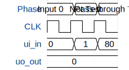

# ^My first design

**Source:** [https://github.com/mabo-elfotoh/my_tiny_tape_design](https://github.com/mabo-elfotoh/my_tiny_tape_design)

**TinyTapeout Project Page:** [https://app.tinytapeout.com/projects/3599](https://app.tinytapeout.com/projects/3599)

## Input/Output Definitions

| Signal | Type | Width |
|--------|------|-------|
| ui_in | input | 8 |
| uo_out | output | 8 |

## First 10 Cycles

| Cycle | Phase | ui_in | uo_out |
|-------|-------|-------|-------|
| 0 | Input 0 | 0x0 (Data=0) | 0x0 (output and=0, output or=0) |
| 1 | Not Test | 0x1 (Data=1) | 0x0 (output and=0, output or=0) |
| 2 | Pass-through Test | 0x50 (Data=80) | 0x0 (output and=0, output or=0) |

## Bit Patterns

### Input (ui_in)
- **ui_in**: Input signal mappings

### Output (uo_out)
- **uo_out**: Output signal mappings

## Test Waveform

