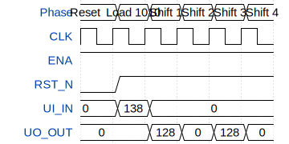

# Simon Says

**Source:** [https://github.com/dabro02/Daniel-s-Wokwi-Design](https://github.com/dabro02/Daniel-s-Wokwi-Design)

**TinyTapeout Project Page:** [https://app.tinytapeout.com/projects/3600](https://app.tinytapeout.com/projects/3600)

## Input/Output Definitions

| Signal | Type | Width |
|--------|------|-------|
| ENA | input | 1 |
| RST_N | input | 1 |
| UI_IN | input | 8 |
| UO_OUT | output | 8 |

## First 10 Cycles

| Cycle | Phase | ENA | RST_N | UI_IN | UO_OUT |
|-------|-------|-------|-------|-------|-------|
| 0 | Reset | 0x1 | 0x0 | 0x0 | 0x0 |
| 1 | Load 1010 | 0x1 | 0x1 | 0x8a | 0x0 |
| 2 | Shift 1 | 0x1 | 0x1 | 0x0 | 0x80 |
| 3 | Shift 2 | 0x1 | 0x1 | 0x0 | 0x0 |
| 4 | Shift 3 | 0x1 | 0x1 | 0x0 | 0x80 |
| 5 | Shift 4 | 0x1 | 0x1 | 0x0 | 0x0 |

## Test Waveform

