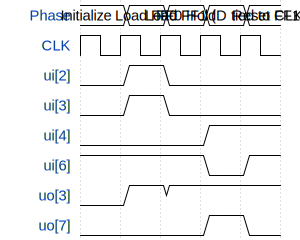

# Flip-Flop Test

**Source:** [https://github.com/PleinR02/test](https://github.com/PleinR02/test)

**TinyTapeout Project Page:** [https://app.tinytapeout.com/projects/3602](https://app.tinytapeout.com/projects/3602)

## Input/Output Definitions

| Signal | Type | Width |
|--------|------|-------|
| ui[2] | input | 1 |
| ui[3] | input | 1 |
| ui[4] | input | 1 |
| ui[6] | input | 1 |
| uo[3] | output | 1 |
| uo[7] | output | 1 |

## Test Waveform

