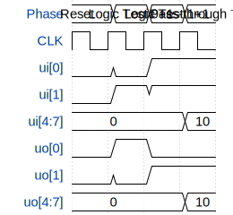

# Switch Puzzle Logic

**Source:** [https://github.com/RimaitosLab/TinyTapeoutWorkshop](https://github.com/RimaitosLab/TinyTapeoutWorkshop)

**TinyTapeout Project Page:** [https://app.tinytapeout.com/projects/3607](https://app.tinytapeout.com/projects/3607)

## Input/Output Definitions

| Signal | Type | Width |
|--------|------|-------|
| ui[0] | input | 1 |
| ui[1] | input | 1 |
| ui[4:7] | input | 4 |
| uo[0] | output | 1 |
| uo[1] | output | 1 |
| uo[4:7] | output | 4 |

## Test Waveform

