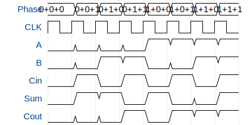

# Full Adder (Doom?)

**Source:** [https://github.com/TobisMa/GDS](https://github.com/TobisMa/GDS)

**TinyTapeout Project Page:** [https://app.tinytapeout.com/projects/3608](https://app.tinytapeout.com/projects/3608)

## Input/Output Definitions

| Signal | Type | Width |
|--------|------|-------|
| A | input | 1 |
| B | input | 1 |
| Cin | input | 1 |
| Sum | output | 1 |
| Cout | output | 1 |

## First 10 Cycles

| Cycle | Phase | A | B | Cin | Sum | Cout |
|-------|-------|-------|-------|-------|-------|-------|
| 0 | 0+0+0 | 0x0 | 0x0 | 0x0 | 0x0 | 0x0 |
| 1 | 0+0+1 | 0x0 | 0x0 | 0x1 | 0x1 | 0x0 |
| 2 | 0+1+0 | 0x0 | 0x1 | 0x0 | 0x1 | 0x0 |
| 3 | 0+1+1 | 0x0 | 0x1 | 0x1 | 0x0 | 0x1 |
| 4 | 1+0+0 | 0x1 | 0x0 | 0x0 | 0x1 | 0x0 |
| 5 | 1+0+1 | 0x1 | 0x0 | 0x1 | 0x0 | 0x1 |
| 6 | 1+1+0 | 0x1 | 0x1 | 0x0 | 0x0 | 0x1 |
| 7 | 1+1+1 | 0x1 | 0x1 | 0x1 | 0x1 | 0x1 |

## Test Waveform

