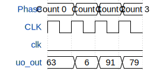

# Count Upwards (7-segment)

**Source:** [https://github.com/Andreas-Noebel/Tiny-Tapeout](https://github.com/Andreas-Noebel/Tiny-Tapeout)

**TinyTapeout Project Page:** [https://app.tinytapeout.com/projects/3611](https://app.tinytapeout.com/projects/3611)

## Input/Output Definitions

| Signal | Type | Width |
|--------|------|-------|
| uo_out | output | 8 |
| clk | clock | 1 |
| rst_n | input | 1 |

## Bit Patterns

### Output (uo_out)
- **uo_out**: Output signal mappings

## Test Waveform

