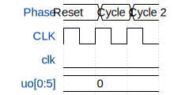

# 6-bit Ring Register

**Source:** [https://github.com/flo100500/tinytapeout](https://github.com/flo100500/tinytapeout)

**TinyTapeout Project Page:** [https://app.tinytapeout.com/projects/3612](https://app.tinytapeout.com/projects/3612)

## Input/Output Definitions

| Signal | Type | Width |
|--------|------|-------|
| clk | clock | 1 |
| uo[0:5] | output | 6 |

## Test Waveform

