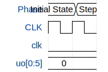

# 6-bit Ring Register WIP

**Source:** [https://github.com/plhrtr/TinyTapeOutTest](https://github.com/plhrtr/TinyTapeOutTest)

**TinyTapeout Project Page:** [https://app.tinytapeout.com/projects/3617](https://app.tinytapeout.com/projects/3617)

## Input/Output Definitions

| Signal | Type | Width |
|--------|------|-------|
| clk | clock | 1 |
| uo[0:5] | output | 6 |

## Test Waveform

