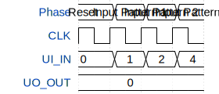

# Test

**Source:** [https://github.com/can-lehmann/tt-fpga](https://github.com/can-lehmann/tt-fpga)

**TinyTapeout Project Page:** [https://app.tinytapeout.com/projects/3620](https://app.tinytapeout.com/projects/3620)

## Input/Output Definitions

| Signal | Type | Width |
|--------|------|-------|
| CLK | clock | 1 |
| UI_IN | input | 8 |
| UO_OUT | output | 8 |

## First 10 Cycles

| Cycle | Phase | UI_IN | UO_OUT |
|-------|-------|-------|-------|
| 0 | Reset | 0x0 | 0x0 |
| 1 | Input Pattern 1 | 0x1 | 0x0 |
| 2 | Input Pattern 2 | 0x2 | 0x0 |
| 3 | Input Pattern 3 | 0x4 | 0x0 |

## Test Waveform

