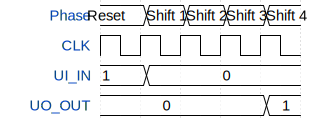

# little frequency divider

**Source:** [https://github.com/pauld0503/paul_tiny_tapeout](https://github.com/pauld0503/paul_tiny_tapeout)

**TinyTapeout Project Page:** [https://app.tinytapeout.com/projects/3623](https://app.tinytapeout.com/projects/3623)

## Input/Output Definitions

| Signal | Type | Width |
|--------|------|-------|
| CLK | clock | 1 |
| UI_IN | input | 8 |
| UO_OUT | output | 8 |

## First 10 Cycles

| Cycle | Phase | UI_IN | UO_OUT |
|-------|-------|-------|-------|
| 0 | Reset | 0x1 | 0x0 |
| 1 | Shift 1 | 0x0 | 0x0 |
| 2 | Shift 2 | 0x0 | 0x0 |
| 3 | Shift 3 | 0x0 | 0x0 |
| 4 | Shift 4 | 0x0 | 0x1 |

## Test Waveform

