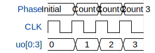

# DR Flip-flop Counter

**Source:** [https://github.com/Estel64/Beccas_tinytapeout](https://github.com/Estel64/Beccas_tinytapeout)

**TinyTapeout Project Page:** [https://app.tinytapeout.com/projects/3627](https://app.tinytapeout.com/projects/3627)

## Input/Output Definitions

| Signal | Type | Width |
|--------|------|-------|
| CLK | clock | 1 |
| uo[0:3] | output | 4 |

## First 10 Cycles

| Cycle | Phase | uo[0:3] |
|-------|-------|-------|
| 0 | Initial | 0x0 |
| 1 | Count 1 | 0x1 |
| 2 | Count 2 | 0x2 |
| 3 | Count 3 | 0x3 |

## Test Waveform

