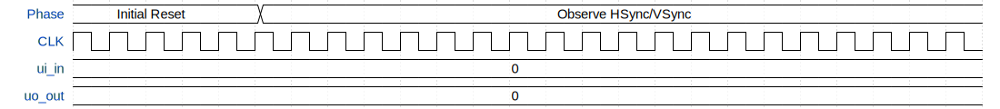

# VGA Maze Runner

**Source:** [https://github.com/phsauter/vga-playground-maze](https://github.com/phsauter/vga-playground-maze)

**TinyTapeout Project Page:** [https://app.tinytapeout.com/projects/3633](https://app.tinytapeout.com/projects/3633)

## Input/Output Definitions

| Signal | Type | Width |
|--------|------|-------|
| ui_in | input | 8 |
| uo_out | output | 8 |

## First 10 Cycles

| Cycle | Phase | ui_in | uo_out |
|-------|-------|-------|-------|
| 0 | Initial Reset | 0x0 (pmod_latch=0, pmod_clk=0, pmod_data=0) | 0x0 (R1=0, G1=0, B1=0, VSync=0, R0=0, G0=0, B0=0, HSync=0) |
| 1 | Initial Reset | 0x0 (pmod_latch=0, pmod_clk=0, pmod_data=0) | 0x0 (R1=0, G1=0, B1=0, VSync=0, R0=0, G0=0, B0=0, HSync=0) |
| 2 | Initial Reset | 0x0 (pmod_latch=0, pmod_clk=0, pmod_data=0) | 0x0 (R1=0, G1=0, B1=0, VSync=0, R0=0, G0=0, B0=0, HSync=0) |
| 3 | Initial Reset | 0x0 (pmod_latch=0, pmod_clk=0, pmod_data=0) | 0x0 (R1=0, G1=0, B1=0, VSync=0, R0=0, G0=0, B0=0, HSync=0) |
| 4 | Initial Reset | 0x0 (pmod_latch=0, pmod_clk=0, pmod_data=0) | 0x0 (R1=0, G1=0, B1=0, VSync=0, R0=0, G0=0, B0=0, HSync=0) |
| 5 | Observe HSync/VSync | 0x0 (pmod_latch=0, pmod_clk=0, pmod_data=0) | 0x0 (R1=0, G1=0, B1=0, VSync=0, R0=0, G0=0, B0=0, HSync=0) |
| 6 | Observe HSync/VSync | 0x0 (pmod_latch=0, pmod_clk=0, pmod_data=0) | 0x0 (R1=0, G1=0, B1=0, VSync=0, R0=0, G0=0, B0=0, HSync=0) |
| 7 | Observe HSync/VSync | 0x0 (pmod_latch=0, pmod_clk=0, pmod_data=0) | 0x0 (R1=0, G1=0, B1=0, VSync=0, R0=0, G0=0, B0=0, HSync=0) |
| 8 | Observe HSync/VSync | 0x0 (pmod_latch=0, pmod_clk=0, pmod_data=0) | 0x0 (R1=0, G1=0, B1=0, VSync=0, R0=0, G0=0, B0=0, HSync=0) |
| 9 | Observe HSync/VSync | 0x0 (pmod_latch=0, pmod_clk=0, pmod_data=0) | 0x0 (R1=0, G1=0, B1=0, VSync=0, R0=0, G0=0, B0=0, HSync=0) |

## Bit Patterns

### Input (ui_in)
- **ui_in**: Input signal mappings

### Output (uo_out)
- **uo_out**: Output signal mappings

## Test Waveform

