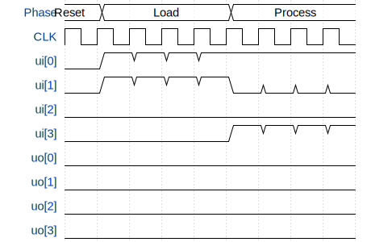

# Bit-Serial Collatz Checker

**Source:** [https://github.com/TheMightyDuckOfDoom/tinytapeout-bit-serial-collatz](https://github.com/TheMightyDuckOfDoom/tinytapeout-bit-serial-collatz)

**TinyTapeout Project Page:** [https://app.tinytapeout.com/projects/3642](https://app.tinytapeout.com/projects/3642)

## Input/Output Definitions

| Signal | Type | Width |
|--------|------|-------|
| CLK | clock | 1 |
| ui[0] | input | 1 |
| ui[1] | input | 1 |
| ui[2] | input | 1 |
| ui[3] | input | 1 |
| uo[0] | output | 1 |
| uo[1] | output | 1 |
| uo[2] | output | 1 |
| uo[3] | output | 1 |

## Test Waveform

