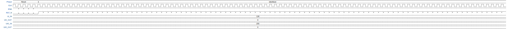

# Borg - Vertex shader

**Source:** [https://github.com/gonsolo/borg_tinyqv](https://github.com/gonsolo/borg_tinyqv)

**TinyTapeout Project Page:** [https://app.tinytapeout.com/projects/3645](https://app.tinytapeout.com/projects/3645)

## Input/Output Definitions

| Signal | Type | Width |
|--------|------|-------|
| ENA | input | 1 |
| RST_N | input | 1 |
| UI_IN | input | 8 |
| UO_OUT | output | 8 |
| UIO_IN | input | 8 |
| UIO_OUT | output | 8 |
| CLK | clock | 1 |

## Test Waveform

