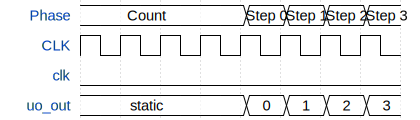

# 4-bit Counter

**Source:** [https://github.com/Galayuda/tt-counter](https://github.com/Galayuda/tt-counter)

**TinyTapeout Project Page:** [https://app.tinytapeout.com/projects/3646](https://app.tinytapeout.com/projects/3646)

## Input/Output Definitions

| Signal | Type | Width |
|--------|------|-------|
| clk | clock | 1 |
| uo_out | output | 8 |

## Bit Patterns

### Output (uo_out)
- **uo_out**: Output signal mappings

## Test Waveform

