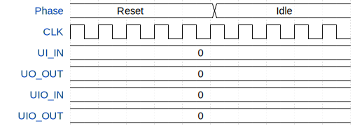

# 2x2 Systolic Array

**Source:** [https://github.com/Essenceia/Systolic_Array_with_DFT_v2](https://github.com/Essenceia/Systolic_Array_with_DFT_v2)

**TinyTapeout Project Page:** [https://app.tinytapeout.com/projects/3647](https://app.tinytapeout.com/projects/3647)

## Input/Output Definitions

| Signal | Type | Width |
|--------|------|-------|
| UI_IN | input | 8 |
| UO_OUT | output | 8 |
| UIO_IN | input | 8 |
| UIO_OUT | output | 8 |

## First 10 Cycles

| Cycle | Phase | UI_IN | UO_OUT | UIO_IN | UIO_OUT |
|-------|-------|-------|-------|-------|-------|
| 0 | Reset | 0x0 | 0x0 | 0x0 | 0x0 |
| 1 | Reset | 0x0 | 0x0 | 0x0 | 0x0 |
| 2 | Reset | 0x0 | 0x0 | 0x0 | 0x0 |
| 3 | Reset | 0x0 | 0x0 | 0x0 | 0x0 |
| 4 | Reset | 0x0 | 0x0 | 0x0 | 0x0 |
| 5 | Idle | 0x0 | 0x0 | 0x0 | 0x0 |
| 6 | Idle | 0x0 | 0x0 | 0x0 | 0x0 |
| 7 | Idle | 0x0 | 0x0 | 0x0 | 0x0 |
| 8 | Idle | 0x0 | 0x0 | 0x0 | 0x0 |
| 9 | Idle | 0x0 | 0x0 | 0x0 | 0x0 |

## Test Waveform

