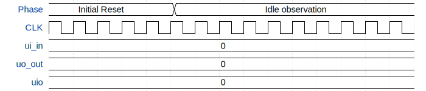

# tophat

**Source:** [https://github.com/pgfarley/tophat](https://github.com/pgfarley/tophat)

**TinyTapeout Project Page:** [https://app.tinytapeout.com/projects/3648](https://app.tinytapeout.com/projects/3648)

## Input/Output Definitions

| Signal | Type | Width |
|--------|------|-------|
| ui_in | input | 8 |
| uo_out | output | 8 |
| uio | inout | 8 |

## First 10 Cycles

| Cycle | Phase | ui_in | uo_out | uio |
|-------|-------|-------|-------|-------|
| 0 | Initial Reset | 0x0 (data_i[0]=0, data_i[1]=0, data_i[2]=0, data_i[3]=0, data_i[4]=0, data_i[5]=0, data_i[6]=0, data_i[7]=0) | 0x0 (prediction[0]=0, prediction[1]=0, prediction[2]=0, prediction[3]=0, prediction[4]=0, prediction[5]=0, prediction[6]=0, prediction[7]=0) | 0x0 |
| 1 | Initial Reset | 0x0 (data_i[0]=0, data_i[1]=0, data_i[2]=0, data_i[3]=0, data_i[4]=0, data_i[5]=0, data_i[6]=0, data_i[7]=0) | 0x0 (prediction[0]=0, prediction[1]=0, prediction[2]=0, prediction[3]=0, prediction[4]=0, prediction[5]=0, prediction[6]=0, prediction[7]=0) | 0x0 |
| 2 | Initial Reset | 0x0 (data_i[0]=0, data_i[1]=0, data_i[2]=0, data_i[3]=0, data_i[4]=0, data_i[5]=0, data_i[6]=0, data_i[7]=0) | 0x0 (prediction[0]=0, prediction[1]=0, prediction[2]=0, prediction[3]=0, prediction[4]=0, prediction[5]=0, prediction[6]=0, prediction[7]=0) | 0x0 |
| 3 | Initial Reset | 0x0 (data_i[0]=0, data_i[1]=0, data_i[2]=0, data_i[3]=0, data_i[4]=0, data_i[5]=0, data_i[6]=0, data_i[7]=0) | 0x0 (prediction[0]=0, prediction[1]=0, prediction[2]=0, prediction[3]=0, prediction[4]=0, prediction[5]=0, prediction[6]=0, prediction[7]=0) | 0x0 |
| 4 | Initial Reset | 0x0 (data_i[0]=0, data_i[1]=0, data_i[2]=0, data_i[3]=0, data_i[4]=0, data_i[5]=0, data_i[6]=0, data_i[7]=0) | 0x0 (prediction[0]=0, prediction[1]=0, prediction[2]=0, prediction[3]=0, prediction[4]=0, prediction[5]=0, prediction[6]=0, prediction[7]=0) | 0x0 |
| 5 | Idle observation | 0x0 (data_i[0]=0, data_i[1]=0, data_i[2]=0, data_i[3]=0, data_i[4]=0, data_i[5]=0, data_i[6]=0, data_i[7]=0) | 0x0 (prediction[0]=0, prediction[1]=0, prediction[2]=0, prediction[3]=0, prediction[4]=0, prediction[5]=0, prediction[6]=0, prediction[7]=0) | 0x0 |
| 6 | Idle observation | 0x0 (data_i[0]=0, data_i[1]=0, data_i[2]=0, data_i[3]=0, data_i[4]=0, data_i[5]=0, data_i[6]=0, data_i[7]=0) | 0x0 (prediction[0]=0, prediction[1]=0, prediction[2]=0, prediction[3]=0, prediction[4]=0, prediction[5]=0, prediction[6]=0, prediction[7]=0) | 0x0 |
| 7 | Idle observation | 0x0 (data_i[0]=0, data_i[1]=0, data_i[2]=0, data_i[3]=0, data_i[4]=0, data_i[5]=0, data_i[6]=0, data_i[7]=0) | 0x0 (prediction[0]=0, prediction[1]=0, prediction[2]=0, prediction[3]=0, prediction[4]=0, prediction[5]=0, prediction[6]=0, prediction[7]=0) | 0x0 |
| 8 | Idle observation | 0x0 (data_i[0]=0, data_i[1]=0, data_i[2]=0, data_i[3]=0, data_i[4]=0, data_i[5]=0, data_i[6]=0, data_i[7]=0) | 0x0 (prediction[0]=0, prediction[1]=0, prediction[2]=0, prediction[3]=0, prediction[4]=0, prediction[5]=0, prediction[6]=0, prediction[7]=0) | 0x0 |
| 9 | Idle observation | 0x0 (data_i[0]=0, data_i[1]=0, data_i[2]=0, data_i[3]=0, data_i[4]=0, data_i[5]=0, data_i[6]=0, data_i[7]=0) | 0x0 (prediction[0]=0, prediction[1]=0, prediction[2]=0, prediction[3]=0, prediction[4]=0, prediction[5]=0, prediction[6]=0, prediction[7]=0) | 0x0 |

## Bit Patterns

### Input (ui_in)
- **ui_in**: Input signal mappings

### Output (uo_out)
- **uo_out**: Output signal mappings

## Test Waveform

