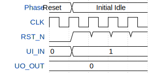

# TinyMOA: RISC-V CPU with CIM Accelerator

**Source:** [https://github.com/EzraWolf/TinyMOA-IHP26a](https://github.com/EzraWolf/TinyMOA-IHP26a)

**TinyTapeout Project Page:** [https://app.tinytapeout.com/projects/3654](https://app.tinytapeout.com/projects/3654)

## Input/Output Definitions

| Signal | Type | Width |
|--------|------|-------|
| CLK | clock | 1 |
| RST_N | input | 1 |
| UI_IN | input | 8 |
| UO_OUT | output | 8 |

## Test Waveform

