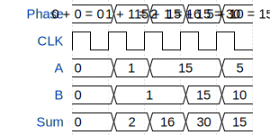

# tt3657-4bit-adder

**Source:** [https://github.com/madsamtoft/TinyTapeout2](https://github.com/madsamtoft/TinyTapeout2)

**TinyTapeout Project Page:** [https://app.tinytapeout.com/projects/3657](https://app.tinytapeout.com/projects/3657)

## Input/Output Definitions

| Signal | Type | Width |
|--------|------|-------|
| A | input | 4 |
| B | input | 4 |
| Sum | output | 5 |

## Test Waveform

