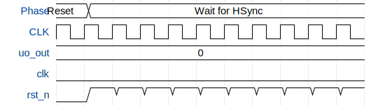

# LLR simple VGA GPU

**Source:** [https://github.com/leonllrmc/tinytapeout_26a_llrsub1](https://github.com/leonllrmc/tinytapeout_26a_llrsub1)

**TinyTapeout Project Page:** [https://app.tinytapeout.com/projects/3661](https://app.tinytapeout.com/projects/3661)

## Input/Output Definitions

| Signal | Type | Width |
|--------|------|-------|
| uo_out | output | 8 |
| clk | clock | 1 |
| rst_n | input | 1 |

## First 10 Cycles

| Cycle | Phase | uo_out | rst_n |
|-------|-------|-------|-------|
| 0 | Reset | 0x0 (R1=0, G1=0, B1=0, VSync=0, R0=0, G0=0, B0=0, HSync=0) | 0x0 |
| 1 | Wait for HSync | 0x0 (R1=0, G1=0, B1=0, VSync=0, R0=0, G0=0, B0=0, HSync=0) | 0x1 |
| 2 | Wait for HSync | 0x0 (R1=0, G1=0, B1=0, VSync=0, R0=0, G0=0, B0=0, HSync=0) | 0x1 |
| 3 | Wait for HSync | 0x0 (R1=0, G1=0, B1=0, VSync=0, R0=0, G0=0, B0=0, HSync=0) | 0x1 |
| 4 | Wait for HSync | 0x0 (R1=0, G1=0, B1=0, VSync=0, R0=0, G0=0, B0=0, HSync=0) | 0x1 |
| 5 | Wait for HSync | 0x0 (R1=0, G1=0, B1=0, VSync=0, R0=0, G0=0, B0=0, HSync=0) | 0x1 |
| 6 | Wait for HSync | 0x0 (R1=0, G1=0, B1=0, VSync=0, R0=0, G0=0, B0=0, HSync=0) | 0x1 |
| 7 | Wait for HSync | 0x0 (R1=0, G1=0, B1=0, VSync=0, R0=0, G0=0, B0=0, HSync=0) | 0x1 |
| 8 | Wait for HSync | 0x0 (R1=0, G1=0, B1=0, VSync=0, R0=0, G0=0, B0=0, HSync=0) | 0x1 |
| 9 | Wait for HSync | 0x0 (R1=0, G1=0, B1=0, VSync=0, R0=0, G0=0, B0=0, HSync=0) | 0x1 |

## Bit Patterns

### Output (uo_out)
- **uo_out**: Output signal mappings

## Test Waveform

